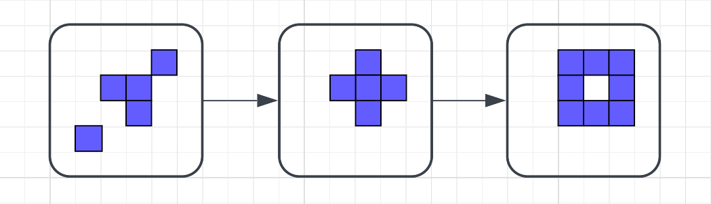

# Proiect "Game of Life" (Proiectarea Algoritmilor) 🎲

Game of Life, creat de matematicianul John Conway, este un „joc" care demonstrează cum, printr-un set de reguli simple, se pot genera comportamente complexe. Nu este, propriu-zis, un joc, ci un automat celular, adică un model matematic care descrie funcționarea sistemelor de calcul (hardware sau software).

## 🔢 Regulile jocului

Game of Life se desfășoară pe o grilă de celule pătrate, în care fiecare celulă poate avea două stări:

- 🟦 **Vie**
- ⬜ **Moartă**

Celulele interacționează cu cele 8 celule vecine ale sale, iar de la o generație la alta, ele urmează aceste reguli:

1. 1️⃣ **Subpopulare** – Orice celulă vie cu mai puțin de 2 vecini moare ☠️
2. 2️⃣ **Supraviețuire** – Orice celulă vie cu 2 sau 3 vecini rămâne în viață 🌱
3. 3️⃣ **Suprapopulare** – Orice celulă vie cu mai mult de 3 vecini moare ☠️
4. 4️⃣ **Reproducere** – Orice celulă moartă cu exact 3 vecini revine la viață 🔄



---

## Task-uri Implementate și Funcționalitatea Lor 🚀

Proiectul este structurat în jurul mai multor task-uri principale, fiecare abordând un aspect specific al jocului "Game of Life" sau o problemă algoritmică asociată:

### 🎯 Task 1: Implementarea regulilor Game of Life

Pentru acest task, veți utiliza o matrice de caractere pentru a simula grila din Game of Life și pentru a reține configurația celulelor într-o anumită generație.

- 🟦 Celulele vii vor fi reprezentate prin caracterul 'X'
- ⬜ Celulele moarte vor fi reprezentate prin caracterul '+'

### 🎯 Task 2: Stocarea eficientă a diferențelor între generații

În situația în care se dorește stocarea tuturor generațiilor, forma matricială este ineficientă, deoarece, în cele mai multe dintre situații, doar o parte din celule își modifică starea de la o generație la alta.

📌 **Soluția:**
În acest task, veți utiliza o structură în care să rețineți doar coordonatele celulelor care se modifică de la o generație la alta.

### 🎯 Task 3: Schimbarea regulilor Game of Life și observarea noii dinamici

În acest task veți crea o alternativă la Game of Life în care există o singură regulă, B, și anume:
📌 Orice celulă cu exact doi vecini vii devine celulă vie.

Pentru a observa diferențele între Game of Life în varianta originală și cel în care se aplică doar noua regulă B, veți utiliza un arbore binar 🌳

### 🎯 Task 4: Desenarea structurilor Game of Life

Se pot desena structurile din Game of Life fără a „ridica de pe hârtie creionul" și trecând printr-o celulă o singură dată? ✏️

O generație din Game of Life poate fi reprezentată sub forma unui graf, în care celulele vii reprezintă vârfurile grafului.
📌 Între două vârfuri există o muchie dacă respectivele celule sunt vecine.

🔍 **Observație:** Generația ilustrată conține 3 structuri (blocuri de celule vii) separate.
🔗 Acest lucru face ca graful generației să fie neconex, având 3 componente conexe.

### 🎯 Bonus Task: Reconstruirea Generației Inițiale ⏪

**Ce face?** Această funcționalitate avansată implementează operația inversă a simulării Game of Life. Primește ca date de intrare:

1. Matricea corespunzătoare unei stări avansate a jocului (Generația K)
2. O "stivă" (sau o secvență) de liste de modificări. Fiecare listă din stivă descrie exact ce celule și-au schimbat starea pentru a se ajunge de la o generație i la generația i+1

Folosind aceste informații, funcția parcurge înapoi în timp, de la Generația K la Generația K-1, apoi la Generația K-2, și tot așa, aplicând invers modificările stocate pentru fiecare pas. Scopul final este de a reconstitui și a scrie în fișierul de output matricea corespunzătoare stării inițiale (Generația 0).

---

## Pentru Contribuitori 🤝

Dacă doriți să contribuiți la acest proiect sau să modificați codul, iată câțiva pași și sugestii:

### Prerechizite

- Un compilator C instalat (de preferință GCC)
- Un sistem de operare compatibil POSIX (Linux, macOS, WSL pe Windows) este recomandat pentru a lucra ușor cu linia de comandă și compilarea

### Clonarea Repository-ului

```bash
git clone https://github.com/draghi-dot/temapa.git
cd temapa
```

### Înțelegerea Structurii

- Analizați secțiunea "Structura Proiectului" de mai sus
- Examinați fișierele sursă (main.c) și antetele (.h) pentru a înțelege cum sunt împărțite modulele și cum interacționează
- Consultați descrierea fiecărui task pentru cerințele specifice


### Modificarea Codului
- Alegeți task-ul sau funcționalitatea pe care doriți să o îmbunătățiți sau corectați
- Implementați modificările, încercând să respectați stilul de cod existent

### Compilarea și Testarea Modificărilor
- Consultați secțiunea "Compilare și Rulare" de mai jos
- Testați modificările cu diverse fișiere de input pentru a vă asigura că funcționează corect și nu introduce regresii


## Compilare și Rulare (Pas cu Pas) ⚙️
- Proiectul este conceput pentru a fi compilat ca un singur fișier sursă principal care include toate celelalte funcționalități din fișierele header.

### Comanda de Compilare
Presupunând că fișierul principal se numește main.c (sau tema.c, adaptează comanda) și toate fișierele .h sunt în același director:

```bash
gcc tema.c -o game_of_life_project -Wall -Wextra -std=c99 -lm
```

Unde:
- `-o game_of_life_project`: Specifică numele executabilului.
- `-Wall -Wextra`: Activează majoritatea avertismentelor utile ale compilatorului.
- `-std=c99`: Specifică standardul C99 (necesar pentru Variable Length Arrays - VLA).
- `-lm`: Link-ează biblioteca matematică (necesară pentru abs).

Formatul Fișierului de Input (general)
Fișierele de input (de ex., in/data11.in) trebuie să respecte formatul:

```bash
T
N M
K
(matricea N x M)
```

Unde:

- `T`: Numărul task-ului (1, 2, 3, 4, sau un număr pentru bonus)
- `N M`: Dimensiunile grilei (număr de linii și coloane)
- `K`: Numărul de generații (sau adâncimea arborelui, în funcție de task)
- Urmează `N` linii, fiecare cu `M` caractere (+ sau X) reprezentând configurația inițială

Exemplu de Rulare
După compilare, rulează executabilul:

./game_of_life_project

✅ Testarea Rezultatelor cu Checker-ul
Pentru a verifica corectitudinea rezultatelor, poți utiliza un checker dedicat. Urmează pașii de mai jos:

1️⃣ Asigură-te că valgrind este instalat:
Pe sistemele Linux, rulează următoarele comenzi:

```bash
sudo apt update
sudo apt install valgrind
```

2️⃣ Rulează checker-ul:
Checker-ul poate fi rulat în mod interactiv folosind comanda:


```bash
# -i = interactiv
./checker-linux-amd64 -i
```

⚠️ Note Importante:
Checker-ul funcționează doar pe Linux.
Dacă folosești Windows, poți utiliza WSL (Windows Subsystem for Linux) pentru a rula checker-ul.
Dacă folosești macOS, poți utiliza Docker pentru a crea un mediu compatibil Linux.

```